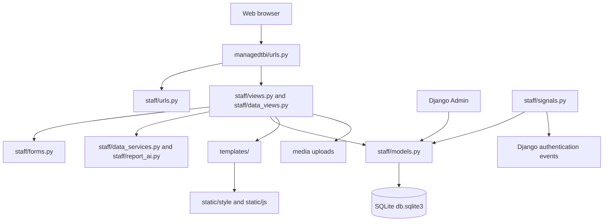

# ManagedTBI System Overview

## 1. Purpose

ManagedTBI is a Django-based startup incubation and investment-readiness platform. It provides a public-facing landing experience and an authenticated workspace where startup owners and administrators can manage startup profiles and related business information.

The implemented system covers:

- Startup registration and profile management
- Founder and team information
- Incubation and contract details
- Funding records
- Key performance indicators (KPIs)
- Pitch-deck uploads
- Services offered by startups
- Startup opportunities
- Partnership requests
- BUNI-to-DTBi participant journeys, programme-stage history, support delivery, follow-ups, and dated outcome snapshots
- Mentor session scheduling, overlap checks, session history, and calendar exports
- Staff Data Hub for bulk imports, page-visit statistics, partnership management, and programme reports
- User accounts and profiles, startup ownership, role-aware staff/admin workflows, login tracking, and saved display preferences
- Administrative access through Django Admin

The public landing page presents BUNI and DTBi together and shows database-backed ecosystem totals. Its hero copy contains a full-bleed slideshow that cycles through the four local staff images every 2.5 seconds. Each image covers the hero background with an individually tuned focal position and a subtle dark overlay; centered white text and actions sit directly over the photos without a backing card. The shared page-content background has a slow, low-contrast gradient animation. The slideshow and background animation respect reduced-motion preferences. Its funding tile is currently a simple sum of stored amounts with a dollar sign; it does not convert or separate currencies. Use the Data Hub period report for funding totals grouped by recorded currency.

Mentors and investors are database-backed. Their public directories support search, filtering, and pagination, while staff manage source records through Django Admin. Participant, support-delivery, follow-up, and outcome records are private to staff/admin workflows.

The BUNI workbooks in `static/style/buni/` can be loaded with:

```text
python manage.py import_buni_data
```

## 2. Technology Stack

| Area | Technology |
|---|---|
| Backend | Python and Django 5.2.17 (pinned in `requirements.txt`) |
| Database | SQLite (`db.sqlite3`) |
| Image/file handling | Pillow and Django media fields |
| Frontend | Django templates, HTML, CSS, and JavaScript |
| Styling | `static/style/style.css` |
| Browser behavior | `static/js/script.js` and `static/js/ambient.js` |
| Icons | Font Awesome 6.5.1 CDN |
| Authentication | Django built-in authentication |
| Deployment interface | WSGI and ASGI entry points |

## 3. High-Level Architecture



## 4. Project Structure

```text
DTBiSystem/
├── manage.py                    Django command-line entry point
├── requirements.txt             Python dependencies
├── .gitignore                   Local environment and generated-file exclusions
├── db.sqlite3                   Development database
├── managedtbi/
│   ├── settings.py              Django configuration
│   ├── urls.py                  Root URL configuration
│   ├── asgi.py                  ASGI entry point
│   └── wsgi.py                  WSGI entry point
├── staff/
│   ├── models.py                Domain models
│   ├── forms.py                 Model forms and inline formsets
│   ├── views.py                 Request workflows
│   ├── urls.py                  Staff application routes
│   ├── admin.py                 Django Admin registration
│   ├── apps.py                  App configuration and signal loading
│   ├── signals.py               Login and post-migration handlers
│   ├── tests.py                 Automated tests
│   └── migrations/               Database migration history
├── templates/                   Django HTML templates
├── static/                      Source CSS, JavaScript, and images
├── staticfiles/                 Collected/static admin files
└── media/                       User-uploaded files at runtime
```

The Data Hub implementation is split across `staff/data_views.py` (access-controlled HTTP workflows), `staff/data_services.py` (import validation and reporting aggregation), and `staff/report_ai.py` (optional executive summaries). Participant workflow forms are in `staff/forms.py`; persisted data and audit history are in `staff/models.py`.

## 5. Django Configuration

The project configuration is in `managedtbi/settings.py`.

### Installed application

- `staff`
- Django Admin
- Django authentication
- Django content types
- Django sessions
- Django messages
- Django static files

### Database

The development database uses SQLite:

```python
DATABASES = {
    "default": {
        "ENGINE": "django.db.backends.sqlite3",
        "NAME": BASE_DIR / "db.sqlite3",
    }
}
```

### Templates and static files

- Templates: `templates/`
- Static source: `static/`
- Static URL: `/static/`
- Static collection directory: `staticfiles/`
- Media directory: `media/`
- Media URL: `/media/`

The development settings define media storage, but the root URL configuration does not currently add a development media-serving route.

### Authentication settings

- Login URL: `/staff/login/`
- Login redirect: `/staff/`
- Logout redirect setting: `/`
- Custom login and logout views are also available through the staff app.

### Current development settings

The following settings are suitable only for local development and must be changed before production:

- `DEBUG = True`
- A hard-coded development `SECRET_KEY`
- `ALLOWED_HOSTS = ['*', 'localhost', '127.0.0.1']`

## 6. Data Model

All domain models are defined in `staff/models.py`.

### Startup

The central domain object.

Key fields:

- `name`
- Unique auto-generated `slug`
- `startup_type`: public or individual
- `description`, `industry`, and `website`
- `logo` and `cover_image`
- `founded_date`, `incubation_start`, `incubation_end`, and `year_incubated`
- `contract_status`: draft, active, expired, or terminated
- `profile_completion`
- `status`: active, inactive, or pending
- `created_at` and `updated_at`

Behavior:

- Generates a unique slug when saved without one.
- Orders records newest first.
- Calculates profile completion from core fields and related records.
- Owns related founders, opportunities, funding records, KPIs, pitch decks, and services.

### Founder

Stores startup team members.

- Belongs to one `Startup`.
- Stores name, email, phone, role, biography, avatar, LinkedIn, and Twitter details.
- Deleting the startup deletes its founders.

### Opportunity

Stores opportunities associated with a startup.

- Belongs to one `Startup`.
- Stores title, description, type, status, deadline, and creation time.
- Types include funding, mentorship, partnership, market access, and acceleration.

### Funding

Stores funding received or pursued by a startup.

- Belongs to one `Startup`.
- Stores source, amount, funding type, date received, status, notes, and creation time.
- Provides a formatted amount helper for display.

### KPI

Stores a startup performance metric.

- Belongs to one `Startup`.
- Stores metric name, current value, optional target, period, unit, and record date.
- Provides an achievement percentage when a positive target exists.

### PitchDeck

Stores pitch-deck metadata and an optional uploaded file.

- Belongs to one `Startup`.
- Stores title, description, file, presentation date, and creation time.

### ServiceOffered

Stores products or services provided by a startup.

- Belongs to one `Startup`.
- Stores name, description, and category.

### UserProfile

Extends Django's built-in `User` model.

- One-to-one relationship with `User`.
- User types: admin, staff, public startup, and individual startup.
- May link a user to one startup.
- Stores company information, biography, avatar, phone, website, registration date, last login IP, login count, and email-verification fields.
- Stores light/dark/system theme preference and an email-notification preference (email delivery is not currently wired to platform events).
- Provides helpers for checking administrator/startup status and displaying a startup name.

Staff/admin accounts are created by an administrator, not through public registration. New regular staff accounts default to Django `is_staff=True` and `is_superuser=False`; the user-profile signal maps those flags to the `staff` app role. A superuser maps to the `admin` role.

### Mentor and Investor

These records store the BUNI-derived people and investment contacts used by the system. They are registered in Django Admin for administrator-controlled add, edit, and delete operations. The overview counts only active records and never uses hard-coded totals.

### MentorEngagement

Connects a mentor with a startup for a scheduled or completed session.

- Arrangements include date, start time, duration, topics, meeting location/link, and scheduling staff member.
- New arrangements must be future dated, have a start time and meeting instructions, and avoid overlaps for the selected mentor and startup.
- Existing rows default to `completed` so historic session records retain their meaning.
- Staff can confirm, complete, cancel, or mark a no-show; startup owners can see future sessions linked to their own startup.
- `MentorEngagementHistory` records scheduling and subsequent status/date/time changes for reporting and review.
- Calendar files can be downloaded for scheduled or confirmed sessions.
- Reports count completed mentoring as delivered activity and list planned arrangements separately.

### Participant journey and programme outcomes

`ParticipantJourney` is an internal person-centred record. It may be created before a startup is registered and linked to a `Startup` later. It records participant contact details, optional startup, cohort, start date, owner, active/paused/completed/exited status, and current programme stage: BUNI community/outreach, internship, mentoring, pre-incubation, DTBi pre-incubation, incubation, growth, or alumni follow-up.

- `ParticipantJourneyHistory` timestamps stage and status transitions, including the staff member and change note. Admin edits and bulk-imported stage changes also create history.
- `ParticipantSupport` records training/capacity building, fabrication-lab/prototyping, business advisory, market access, finance access, hub linkage, or other delivered support.
- `ParticipantFollowUp` assigns an action to staff or a mentor and can link to an existing `MentorEngagement`; `ParticipantFollowUpHistory` records status transitions.
- `ParticipantOutcome` stores dated full-time/part-time job counts, monthly revenue with currency, customers/users, and milestones. Existing `Funding` remains the source of truth for funding amounts.
- Data Hub reports show stage movements, support delivered, follow-ups, outcome snapshots, and paired outcome changes for participants with snapshots before and during the report period. Repeated snapshots are not added together, and revenue is compared within currency only.
- History starts when the feature is introduced; the system does not fabricate prior stages, support, or outcomes.

### DataImportBatch, PageVisit, and analytics

- `DataImportBatch` tracks private upload metadata, mappings, preview errors, and import counts. Supported record types are startups, mentors, investors, and participant journeys.
- `PageVisit` tracks one startup/mentor/investor profile or directory visit per browser session, entity, and local date; admins can review and mark visits read.
- `SiteVisit` is updated per browser session by middleware for visitor totals. It is not a page-by-page clickstream.
- `StartupStatusHistory` captures status/contract snapshots from when its signal was introduced.

### Partnership and other existing records

### RegistrationRate

Stores aggregate registration statistics for time periods such as all time, today, and this month. The post-migration signal creates default rows when they do not exist.

### ProfileView

Tracks a user viewing another user's profile.

- Stores viewer, viewed profile owner, optional startup, timestamp, and IP address.
- Has a uniqueness rule for the viewer/profile/startup combination.

### LoginNotification

Stores login activity including user, IP address, timestamp, and startup type.

### Partnership

Stores proposals that can connect DTBi/BUNI partners with startups and programme needs.

- Captures the partner/contact, partnership area, proposed contribution, expected startup benefit, and outcomes.
- May be linked to an existing startup; blank means the proposal supports multiple startups or the wider programme.
- Staff/admin workflow tracks pending, review, approved, in-progress, on-hold, completed, and rejected stages.
- Assignments and internal review notes are staff-only; public submitters cannot see internal notes.
- `PartnershipHistory` records submission and status transitions with the acting staff member and review note.
- Partnership volume, pipeline status, completed work, and status history feed period reports.

## 7. URL Reference

Root routes are defined in `managedtbi/urls.py`; staff routes are defined in `staff/urls.py`.

| URL | Access | Function |
|---|---|---|
| `/` | Public | Public landing page with live database-backed totals and startup search |
| `/admin/` | Admin | Django administration site |
| `/staff/login/` | Public | Custom login form |
| `/staff/logout/` | Public | Custom logout action for the current browser session |
| `/staff/register/` | Public | New account registration |
| `/staff/settings/` | Authenticated | Update account details, theme preference, and notification preference |
| `/staff/` | Authenticated | Main authenticated index/dashboard page |
| `/staff/startups/` | Public | Searchable, filterable, paginated startup directory |
| `/staff/startups/create/` | Authenticated | Create a startup and its related records |
| `/staff/startups/<slug>/` | Authenticated | View and, when authorized, edit a startup profile |
| `/staff/partnership/` | Public | Submit a partnership request |
| `/staff/partnership/success/` | Public | Partnership submission confirmation |
| `/staff/data/` | Staff/Admin | Data Hub for imports, reports, visits, partnerships, sessions, and participant journeys |
| `/staff/data/imports/` | Staff/Admin | Preview, map, validate, and commit XLSX/CSV/table-PDF imports (up to 20 MB and 20,000 rows) |
| `/staff/data/reports/` | Staff/Admin | Weekly, monthly, half-year, yearly, or custom period reports; Excel/PDF download and optional AI summary |
| `/staff/data/page-visits/` | Admin | Search, filter, paginate, and acknowledge startup/mentor/investor page-visit records |
| `/staff/data/partnerships/` | Staff/Admin | Review, assign, and track partnership requests |
| `/staff/data/participant-journey/` | Staff/Admin | Manage participant stages, support delivery, follow-ups, and outcome snapshots |
| `/staff/mentors/` | Public | Searchable, filterable, paginated mentor directory |
| `/staff/mentor-sessions/` | Staff/Admin | Schedule, search, paginate, and update mentor appointments |
| `/staff/mentor-sessions/<id>/calendar.ics` | Staff/Admin | Download an appointment for a calendar |
| `/staff/mentors/<id>/` | Public | Mentor profile; authenticated staff can record completed sessions and authorized users can view scheduled support |
| `/staff/investors/` | Public | Searchable, filterable, paginated investor directory |
| `/staff/investors/<id>/` | Public | Investor profile |
| `/staff/staff/` | Staff/Admin | Staff account directory |
| `/staff/visitor-stats/` | Public | JSON visitor totals used by the live overview counter |
| `/accounts/login/` | Public | Django class-based login route |
| `/accounts/logout/` | Authenticated | Django class-based logout route |

## 8. Main User Workflows

### Public visitor

1. Opens `/` and sees the landing page.
2. Browses the startup list.
3. Searches startups by name, industry, description, or source, and filters by industry, status, or type. Filter dropdowns apply immediately without a separate apply button, retain other selected filters and the search term, and reset pagination. Industry choices include 17 common BUNI/DTBi sectors plus any unmatched industry labels already in the directory. Sector filters match keywords against the recorded industry field; categories without matching records return no rows. The initial count shows the directory total; after a search/filter, it shows the matching result count. Directory pages are paginated.
4. Submits a partnership request.
5. Opens the login or registration page.

### New startup user

1. Registers at `/staff/register/`.
2. Selects `public` or `individual` account type.
3. The account is created with Django staff/superuser flags off and the visitor is sent to sign in.
4. After sign-in, is redirected to startup creation if no startup is linked.
5. Completes the startup form and related inline sections.
6. The system saves the startup, founder, opportunity, funding, KPI, pitch-deck, and service records in one transaction.
7. The startup is linked to the user's profile.
8. Profile completion is calculated and the startup profile is displayed.

At least one founder is required during startup creation.

### Returning user login

1. Submits username and password.
2. The system creates a missing `UserProfile` if necessary.
3. Superusers map to the `admin` app role; Django staff accounts map to the `staff` app role; ordinary accounts retain their selected startup-account type.
4. Login count and remote IP are updated.
5. A login notification is created by the login signal.
6. Startup users go to their startup profile or startup creation page.
7. Administrators go to the dashboard.

The selected login type is checked against the account's Django flags and stored app role. Selecting Admin does not grant admin access. Standard staff accounts have Django Staff status on and Superuser status off.

### Startup profile editing

- Any authenticated user may view a startup profile.
- The startup owner may edit their own startup.
- Administrators and Django staff users may edit any startup.
- Owners receive the restricted `StartupOwnerForm`.
- Administrators receive the full `StartupForm`, including administrative fields.
- Related inline records are updated together with the startup.

### Partnership request

1. A visitor submits the partnership form.
2. The request is stored as a `Partnership` with `pending` status, and its initial status event is recorded.
3. Staff/admin review the contribution, intended startup benefit, and outcomes in the Partnership Pipeline.
4. A staff owner can be assigned, internal review notes added, and status advanced through delivery or closed as completed/rejected.
5. Status changes are retained in `PartnershipHistory` and included in selected-period reports.

### Staff Data Hub and bulk import

1. Staff/admin open `/staff/data/` and choose imports, reports, page visits, partnerships, mentor sessions, or Participant Journey.
2. The importer accepts Excel (`.xlsx`), CSV, and table-based text PDFs, up to 20 MB and 20,000 data rows. It reads the first Excel worksheet; scanned PDFs require conversion to a supported table/text format.
3. Staff map file columns to system fields, review duplicate identities and row validation issues, then explicitly confirm the import. A batch records created, updated, and skipped rows; issue rows can be downloaded as CSV.
4. Participant imports match by email or name/cohort. Optional startup links require one exact match to an existing startup; imports never silently create linked startup records.

### Participant journey, support, and outcomes

1. Staff create an internal participant record at any supported programme stage; linking a startup is optional at first.
2. Staff update current stage/status, cohort, journey owner, and a change note. Each initial record and transition is timestamped in the history.
3. Staff record non-mentoring support delivered and assign follow-up actions. Follow-ups may refer to an existing mentor or mentor session; session delivery itself stays in `MentorEngagement`.
4. Staff record dated outcome snapshots for jobs, monthly revenue/currency, customers/users, and milestones. Existing `Funding` records are used for investment totals.
5. Reports compare outcomes only for participants with a snapshot before and another within the period. The app does not treat snapshots as period additions and does not combine currencies.

### Programme reports and page visits

- Report periods: current week, month, half-year, year, or custom dates. Reports are viewable online and downloadable as Excel or PDF.
- Reports include startups and status, funding, KPIs, completed and scheduled mentor sessions, partnerships, page visits, participant journey changes, delivered support, follow-ups, and outcome snapshots/comparisons.
- AI executive summaries are optional. With no API key, summaries use local aggregate calculations. With a configured provider, only aggregate metrics are submitted; names, emails, and individual records are excluded. Set `DTBI_AI_API_KEY`, optionally `DTBI_AI_MODEL`, and optionally `DTBI_AI_BASE_URL`.
- Startup, mentor, and investor detail pages and directories record one visit per browser session, entity, and local day. Admins review and mark records read in Page Visit Notifications.

## 9. Forms and Validation

`staff/forms.py` provides:

- `StartupForm`
- `StartupOwnerForm`
- `FounderForm`
- `OpportunityForm`
- `FundingForm`
- `KPIForm`
- `PitchDeckForm`
- `ServiceOfferedForm`
- `PartnershipForm`
- `MentorEngagementScheduleForm`
- `ParticipantJourneyForm`
- `ParticipantSupportForm`
- `ParticipantFollowUpForm`
- `ParticipantOutcomeForm`

Inline formsets connect the related records to a startup:

- Founders
- Opportunities
- Funding
- KPIs
- Pitch decks
- Services

`FounderFormSet` requires at least one founder. The other related formsets allow optional additional records.

## 10. Templates and Frontend

Templates are stored in `templates/`.

| Template | Responsibility |
|---|---|
| `base.html` | Shared layout, sidebar, top bar, navigation, authentication controls, CSS, and JavaScript loading; the top bar shows DTBi, BUNI, and Fursa Hub logos |
| `landing.html` | Public BUNI–DTBi overview with live totals, startup search, full-background staff slideshow with centered text overlay, and visitor pulse |
| `index.html` | Authenticated home page with recent startups and registration information |
| `startups.html` | Startup table, search, and immediate industry/status/type filtering |
| `startup_profile.html` | Startup overview and create/edit form with related sections |
| `mentor_profile.html` | Mentor information and permitted session activity |
| `investor_profile.html` | Investor details and funding links |
| `partnership_form.html` | Partnership request form |
| `partnership_success.html` | Partnership confirmation |
| `partnership_inbox.html` | Staff/admin partnership workflow and status history |
| `mentor_sessions.html` | Staff/admin appointment scheduling and follow-up |
| `participant_journey.html` | Staff/admin participant stages, support, follow-ups, history, and outcomes |
| `data_hub.html` | Staff/admin entry point for imports, reports, partnerships, appointments, and participant tracking |
| `data_import.html` | Private mapped import preview, row validation, and import result |
| `data_reports.html` | Period metrics, outcome comparisons, optional AI summary, and report download links |
| `page_visit_admin.html` | Admin-only page-visit notifications and filters |
| `settings.html` | Authenticated profile, theme, and account preferences |
| `mentors.html` | Database-backed mentor directory |
| `investors.html` | Database-backed investor directory |
| `staff_list.html` | Restricted staff account directory |
| `public_page.html` | Present but not currently referenced by a view |
| `registration/login.html` | Login page |
| `registration/register.html` | Registration page |
| `partials/form_errors.html` | Reusable form error display |
| `partials/formset_errors.html` | Reusable formset error display |

Frontend assets:

- `static/style/style.css`: application styling, including a subtle animated gradient behind shared page content (decorative and non-interactive) and a full-bleed staff-photo hero slideshow with centered white text over a subtle dark overlay and no backing card.
- `static/js/script.js`: shared browser interactions and sidebar behavior.
- `static/js/ambient.js`: low-contrast binary rain in the sidebar and overview hero; it is local, pauses when the tab is hidden, and is disabled for reduced-motion preferences.
- `static/img/brands/staff.jpeg` and `staff1.jpeg`–`staff3.jpeg`: local images used by the overview hero slideshow.
- `static/img/brands/fursahub.png`: Fursa Hub logo shown in the shared top bar.
- `partials/pagination.html`: shared server-side pagination controls that retain the current search/filter criteria.
- `static/img/dtbi-logo.svg`: available logo asset.
- `staticfiles/`: collected static files and Django Admin assets.

## 11. Signals

`staff/signals.py` contains the following behavior:

- Creates a `LoginNotification` when a user logs in.
- Synchronizes `UserProfile.user_type` from Django auth flags: superuser becomes admin; `is_staff` becomes staff.
- Records `StartupStatusHistory` when a startup is created or its status/contract status changes.
- Creates initial `RegistrationRate` rows after migrations if they do not exist. It does not keep their totals current when users register.
- Login alerts are stored in the database. Email-notification preferences are stored but no email delivery workflow is connected.

Signals are loaded through the app configuration in `staff/apps.py`.

## 12. Database Migrations

Migration files run in sequence from `0001_initial.py` through `0016_alter_dataimportbatch_dataset.py`. The chain adds startup/account data, visitor and people records, profile preferences, funding/import/session history, and the partnership workflow, then the Participant Journey models and participant import choice. The current database has migrations through `0016` applied. New participant tables are additive; no historical stages or outcome snapshots were backfilled.

## 13. Local Setup and Operation

From the project root in PowerShell:

```powershell
python -m venv .venv
.\.venv\Scripts\Activate.ps1
python -m pip install -r requirements.txt
python manage.py migrate
python manage.py check
python manage.py runserver
```

Open:

```text
http://127.0.0.1:8000/
```

Useful commands:

```powershell
python manage.py createsuperuser
python manage.py makemigrations
python manage.py migrate
python manage.py test
python manage.py collectstatic
```

AI report summaries are disabled unless `DTBI_AI_API_KEY` is configured. Optional settings are `DTBI_AI_MODEL` and `DTBI_AI_BASE_URL`. Without a key, the report uses its local rule-based summary.

## 14. Automated Tests

Tests are located in `staff/tests.py` and cover:

- Anonymous access restrictions
- Registration and admin-type rejection
- Duplicate usernames
- Startup creation and ownership linking
- Required founder validation
- One-startup-per-account behavior
- Unique slug generation
- Owner editing versus stranger read-only access
- Landing, login, registration, dashboard, startup-list, and template behavior

The automated test suite was not run during the latest feature/documentation update. Do not interpret the system check or template compilation as a test-suite result.

## 15. Current Limitations and Risks

Current known limitations and operational considerations:

1. `dashboard()` and `profile_view_notification()` remain legacy, unrouted views; their referenced templates are absent. The active authenticated landing is `staff:index` at `/staff/`.
2. `RegistrationRate` entries are initialized after migrations but registration events do not update their totals.
3. `ProfileView` and `profile_view_notification()` are not connected to normal profile browsing. Separate `SiteVisit` and `PageVisit` tracking does operate for visitor totals and startup/mentor/investor directories and profiles.
4. Outcome comparisons need at least one snapshot from before the reporting period and one during it. New participant records without a baseline are reported as snapshots but excluded from change comparisons.
5. Participant programme stages and support types are fixed in model choices. Change them through a planned code/migration update, not free text. Evidence attachments and formal attendance/session registration for training or lab use are not yet implemented.
6. Participant outcome snapshots are staff-entered monitoring data, not independently verified financial/employment records. Reports should be read as data entered in the system.
7. The importer reads the first worksheet from an Excel workbook and extracts tabular text from PDFs; it does not OCR scanned documents.
8. `email_notifications` is a saved preference, but outgoing event email is not implemented. The configured development email backend writes to the console.
9. Media storage is configured, but the root URL configuration does not serve media in development. Configure production storage and permissions before deployment.
10. Public landing funding is summed across stored amounts and shown with a dollar sign, without currency conversion. Prefer currency-grouped period reports for financial comparison.
11. Registration's custom password handler does not call Django's configured password validators; add explicit validation before production.
12. Development-only security settings must be replaced for production: debug mode, development secret, permissive hosts, SQLite, and deployment/server configuration.

## 16. Recommended Next Steps

### Operational quality

- Validate the Participant Journey stages, support categories, and outcome definitions with BUNI and DTBi programme teams before loading large historical workbooks.
- Establish a regular outcome snapshot cadence and clear definitions for jobs, monthly revenue, and customers/users.
- Add evidence/attendance records and configurable programme stages if staff need audit-level evidence or new cohorts frequently.
- Decide whether to remove or complete the unused legacy dashboard/ProfileView views, and make registration totals event-driven if those dashboard metrics are still needed.
- Add automated coverage for the new participant journey, import, report, and permissions workflows before release.

### Production readiness

- Move secrets and configuration to environment variables.
- Set `DEBUG = False` in production.
- Restrict `ALLOWED_HOSTS`.
- Use a production database and deployment server.
- Configure secure uploaded-file storage.
- Add CSRF, secure-cookie, HTTPS, logging, backup, and monitoring settings.
- Add CI checks for migrations, system checks, and tests.

## 17. Current Status

The local SQLite database has migrations applied through `0016`. The latest startup-filter and overview presentation changes were checked with `git diff --check`; Python syntax compilation passed for the updated view. `manage.py check` could not complete in the current environment because `openpyxl` is missing, and the automated test suite was not run. At the earlier participant workflow checkpoint, `manage.py check` reported no issues, `makemigrations --check --dry-run` reported no pending model changes, and the participant, import, report, and base templates compiled.
