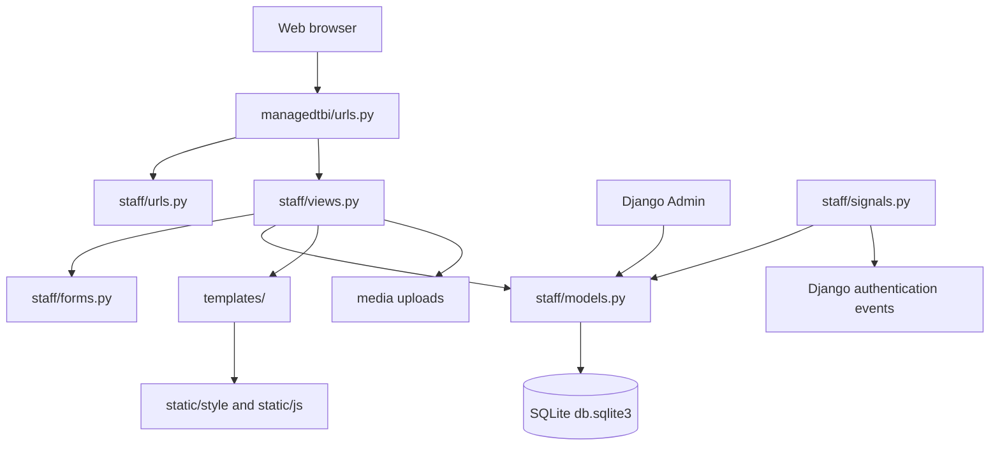

# ManagedTBI System Overview

## 1. Purpose

ManagedTBI is a Django-based startup incubation and investment-readiness platform. It provides a public-facing landing experience and an authenticated workspace where startup owners and administrators can manage startup profiles and related business information.

The implemented system covers:

- Startup registration and profile management
- Founder and team information
- Incubation and contract details
- Funding records
- Key performance indicators (KPIs)
- Pitch-deck uploads
- Services offered by startups
- Startup opportunities
- Partnership requests
- User accounts, profiles, login tracking, and profile ownership
- Administrative access through Django Admin

Mentors, investors, and staff are persisted records. Mentors and investors are managed by administrators through Django Admin, and their public panels and overview totals read directly from the database.

The BUNI workbooks in `static/style/buni/` can be loaded with:

```text
python manage.py import_buni_data
```

## 2. Technology Stack

| Area | Technology |
|---|---|
| Backend | Python and Django 5.1.4 |
| Database | SQLite (`db.sqlite3`) |
| Image/file handling | Pillow and Django media fields |
| Frontend | Django templates, HTML, CSS, and JavaScript |
| Styling | `static/style/style.css` |
| Browser behavior | `static/js/script.js` |
| Icons | Font Awesome 6.5.1 CDN |
| Authentication | Django built-in authentication |
| Deployment interface | WSGI and ASGI entry points |

## 3. High-Level Architecture



## 4. Project Structure

```text
DTBiSystem/
├── manage.py                    Django command-line entry point
├── requirements.txt             Python dependencies
├── .gitignore                   Local environment and generated-file exclusions
├── db.sqlite3                   Development database
├── managedtbi/
│   ├── settings.py              Django configuration
│   ├── urls.py                  Root URL configuration
│   ├── asgi.py                  ASGI entry point
│   └── wsgi.py                  WSGI entry point
├── staff/
│   ├── models.py                Domain models
│   ├── forms.py                 Model forms and inline formsets
│   ├── views.py                 Request workflows
│   ├── urls.py                  Staff application routes
│   ├── admin.py                 Django Admin registration
│   ├── apps.py                  App configuration and signal loading
│   ├── signals.py               Login and post-migration handlers
│   ├── tests.py                 Automated tests
│   └── migrations/               Database migration history
├── templates/                   Django HTML templates
├── static/                      Source CSS, JavaScript, and images
├── staticfiles/                 Collected/static admin files
└── media/                       User-uploaded files at runtime
```

## 5. Django Configuration

The project configuration is in `managedtbi/settings.py`.

### Installed application

- `staff`
- Django Admin
- Django authentication
- Django content types
- Django sessions
- Django messages
- Django static files

### Database

The development database uses SQLite:

```python
DATABASES = {
    "default": {
        "ENGINE": "django.db.backends.sqlite3",
        "NAME": BASE_DIR / "db.sqlite3",
    }
}
```

### Templates and static files

- Templates: `templates/`
- Static source: `static/`
- Static URL: `/static/`
- Static collection directory: `staticfiles/`
- Media directory: `media/`
- Media URL: `/media/`

The development settings define media storage, but the root URL configuration does not currently add a development media-serving route.

### Authentication settings

- Login URL: `/staff/login/`
- Login redirect: `/staff/`
- Logout redirect setting: `/`
- Custom login and logout views are also available through the staff app.

### Current development settings

The following settings are suitable only for local development and must be changed before production:

- `DEBUG = True`
- A hard-coded development `SECRET_KEY`
- `ALLOWED_HOSTS = ['*', 'localhost', '127.0.0.1']`

## 6. Data Model

All domain models are defined in `staff/models.py`.

### Startup

The central domain object.

Key fields:

- `name`
- Unique auto-generated `slug`
- `startup_type`: public or individual
- `description`, `industry`, and `website`
- `logo` and `cover_image`
- `founded_date`, `incubation_start`, `incubation_end`, and `year_incubated`
- `contract_status`: draft, active, expired, or terminated
- `profile_completion`
- `status`: active, inactive, or pending
- `created_at` and `updated_at`

Behavior:

- Generates a unique slug when saved without one.
- Orders records newest first.
- Calculates profile completion from core fields and related records.
- Owns related founders, opportunities, funding records, KPIs, pitch decks, and services.

### Founder

Stores startup team members.

- Belongs to one `Startup`.
- Stores name, email, phone, role, biography, avatar, LinkedIn, and Twitter details.
- Deleting the startup deletes its founders.

### Opportunity

Stores opportunities associated with a startup.

- Belongs to one `Startup`.
- Stores title, description, type, status, deadline, and creation time.
- Types include funding, mentorship, partnership, market access, and acceleration.

### Funding

Stores funding received or pursued by a startup.

- Belongs to one `Startup`.
- Stores source, amount, funding type, date received, status, notes, and creation time.
- Provides a formatted amount helper for display.

### KPI

Stores a startup performance metric.

- Belongs to one `Startup`.
- Stores metric name, current value, optional target, period, unit, and record date.
- Provides an achievement percentage when a positive target exists.

### PitchDeck

Stores pitch-deck metadata and an optional uploaded file.

- Belongs to one `Startup`.
- Stores title, description, file, presentation date, and creation time.

### ServiceOffered

Stores products or services provided by a startup.

- Belongs to one `Startup`.
- Stores name, description, and category.

### UserProfile

Extends Django's built-in `User` model.

- One-to-one relationship with `User`.
- User types: admin, public startup, and individual startup.
- May link a user to one startup.
- Stores company information, biography, avatar, phone, website, registration date, last login IP, login count, and email-verification fields.
- Provides helpers for checking administrator/startup status and displaying a startup name.

### Mentor and Investor

These records store the BUNI-derived people and investment contacts used by the system. They are registered in Django Admin for administrator-controlled add, edit, and delete operations. The overview counts only active records and never uses hard-coded totals.

### RegistrationRate

Stores aggregate registration statistics for time periods such as all time, today, and this month. The post-migration signal creates default rows when they do not exist.

### ProfileView

Tracks a user viewing another user's profile.

- Stores viewer, viewed profile owner, optional startup, timestamp, and IP address.
- Has a uniqueness rule for the viewer/profile/startup combination.

### LoginNotification

Stores login activity including user, IP address, timestamp, and startup type.

### Partnership

Stores public partnership requests.

- Independent of the `Startup` model.
- Stores startup/contact name, email, phone, organization, partnership type, message, status, and timestamps.
- New submissions default to `pending`.

## 7. URL Reference

Root routes are defined in `managedtbi/urls.py`; staff routes are defined in `staff/urls.py`.

| URL | Access | Function |
|---|---|---|
| `/` | Public | Landing page; authenticated users are sent to the dashboard view |
| `/admin/` | Admin | Django administration site |
| `/staff/login/` | Public | Custom login form |
| `/staff/logout/` | Authenticated | Custom logout action |
| `/staff/register/` | Public | New account registration |
| `/staff/` | Authenticated | Main authenticated index/dashboard page |
| `/staff/startups/` | Public | Startup list with type filtering |
| `/staff/startups/create/` | Authenticated | Create a startup and its related records |
| `/staff/startups/<slug>/` | Authenticated | View and, when authorized, edit a startup profile |
| `/staff/partnership/` | Public | Submit a partnership request |
| `/staff/partnership/success/` | Public | Partnership submission confirmation |
| `/staff/mentors/` | Public | Mentor demonstration page |
| `/staff/investors/` | Public | Investor demonstration page |
| `/staff/staff/` | Public | Staff demonstration page |
| `/accounts/login/` | Public | Django class-based login route |
| `/accounts/logout/` | Authenticated | Django class-based logout route |

## 8. Main User Workflows

### Public visitor

1. Opens `/` and sees the landing page.
2. Browses the startup list.
3. Filters startups by public or individual type.
4. Submits a partnership request.
5. Opens the login or registration page.

### New startup user

1. Registers at `/staff/register/`.
2. Selects `public` or `individual` account type.
3. Is logged in automatically.
4. Is redirected to startup creation.
5. Completes the startup form and related inline sections.
6. The system saves the startup, founder, opportunity, funding, KPI, pitch-deck, and service records in one transaction.
7. The startup is linked to the user's profile.
8. Profile completion is calculated and the startup profile is displayed.

At least one founder is required during startup creation.

### Returning user login

1. Submits username and password.
2. The system creates a missing `UserProfile` if necessary.
3. Staff/superusers are marked as administrators in their profile.
4. Login count and remote IP are updated.
5. A login notification is created by the login signal.
6. Startup users go to their startup profile or startup creation page.
7. Administrators go to the dashboard.

The selected login `user_type` is currently a form value only; it does not enforce account type during authentication.

### Startup profile editing

- Any authenticated user may view a startup profile.
- The startup owner may edit their own startup.
- Administrators and Django staff users may edit any startup.
- Owners receive the restricted `StartupOwnerForm`.
- Administrators receive the full `StartupForm`, including administrative fields.
- Related inline records are updated together with the startup.

### Partnership request

1. A visitor submits the partnership form.
2. The request is stored as a `Partnership` with `pending` status.
3. The visitor is redirected to the success page.

## 9. Forms and Validation

`staff/forms.py` provides:

- `StartupForm`
- `StartupOwnerForm`
- `FounderForm`
- `OpportunityForm`
- `FundingForm`
- `KPIForm`
- `PitchDeckForm`
- `ServiceOfferedForm`
- `PartnershipForm`

Inline formsets connect the related records to a startup:

- Founders
- Opportunities
- Funding
- KPIs
- Pitch decks
- Services

`FounderFormSet` requires at least one founder. The other related formsets allow optional additional records.

## 10. Templates and Frontend

Templates are stored in `templates/`.

| Template | Responsibility |
|---|---|
| `base.html` | Shared layout, sidebar, top bar, navigation, authentication controls, CSS, and JavaScript loading |
| `landing.html` | Public landing page |
| `index.html` | Authenticated home page with recent startups and registration information |
| `startups.html` | Startup table, search, and filtering |
| `startup_profile.html` | Startup overview and create/edit form with related sections |
| `partnership_form.html` | Partnership request form |
| `partnership_success.html` | Partnership confirmation |
| `mentors.html` | Mentor panel/demo page |
| `investors.html` | Investor panel/demo page |
| `staff_list.html` | Staff panel/demo page |
| `public_page.html` | Present but not currently referenced by a view |
| `registration/login.html` | Login page |
| `registration/register.html` | Registration page |
| `partials/form_errors.html` | Reusable form error display |
| `partials/formset_errors.html` | Reusable formset error display |

Frontend assets:

- `static/style/style.css`: application styling.
- `static/js/script.js`: sidebar behavior, filtering, modal handling, and browser-only mentor/investor/staff record manipulation.
- `static/img/dtbi-logo.svg`: available logo asset.
- `staticfiles/`: collected static files and Django Admin assets.

## 11. Signals

`staff/signals.py` contains the following behavior:

- Creates a `LoginNotification` when a user logs in.
- Creates default registration-rate rows after migrations if they do not exist.
- Defines the registration-rate post-migration receiver twice; the existence checks prevent duplicate rows, but the duplicate definition should be cleaned up.
- Contains a profile-view receiver that currently performs no meaningful tracking.

Signals are loaded through the app configuration in `staff/apps.py`.

## 12. Database Migrations

Migration history:

1. `0001_initial.py`
   - Creates the original startup, founder, opportunity, funding, KPI, pitch-deck, service, and partnership tables.
2. `0002_registrationrate_loginnotification_userprofile_and_more.py`
   - Adds registration rates, login notifications, user profiles, and profile views.
3. `0003_alter_startup_contract_status.py`
   - Makes `Startup.contract_status` explicitly blankable.

The latest migration was generated with Django 5.1.4. The first two migration files have older generated headers, but the migration chain applies successfully in the current environment.

## 13. Local Setup and Operation

From the project root in PowerShell:

```powershell
python -m venv .venv
.\.venv\Scripts\Activate.ps1
python -m pip install -r requirements.txt
python manage.py migrate
python manage.py check
python manage.py runserver
```

Open:

```text
http://127.0.0.1:8000/
```

Useful commands:

```powershell
python manage.py createsuperuser
python manage.py makemigrations
python manage.py migrate
python manage.py test
python manage.py collectstatic
```

The current local server has been verified to start successfully and the landing page returns HTTP 200.

## 14. Automated Tests

Tests are located in `staff/tests.py` and cover:

- Anonymous access restrictions
- Registration and admin-type rejection
- Duplicate usernames
- Startup creation and ownership linking
- Required founder validation
- One-startup-per-account behavior
- Unique slug generation
- Owner editing versus stranger read-only access
- Landing, login, registration, dashboard, startup-list, and template behavior

A current environment note: Django system checks pass, but the existing test suite encounters a Python 3.14/Django 5.1.4 compatibility error while the Django test client copies rendered template context. This is separate from normal server startup and should be resolved before relying on the full test suite in CI.

## 15. Current Limitations and Risks

These items are important for the next development phase:

1. `dashboard()` renders `dashboard.html`, but that template is not present in the current templates directory.
2. `profile_view_notification()` renders `profile_views.html`, which is also not present.
3. Those two views do not currently have routes.
4. Custom logout redirects to the protected `staff:dashboard` route after logout, which can send a logged-out user back to login rather than the public landing page.
5. Mentor, investor, and staff records are hard-coded or browser-only and are not database-backed.
6. Registration statistics are not automatically incremented when users register.
7. Profile-view tracking is not connected to normal profile browsing.
8. Login `user_type` is not used to enforce authorization.
9. Password validators are configured in settings but registration uses `create_user()` without explicitly invoking password validation.
10. Media storage is configured, but a development media URL route is not defined.
11. Development-only security settings must be replaced for production.
12. The project name and implemented domain are not fully aligned: the current code is a startup incubation platform, while the parent folder name refers to fleet management and ERP.

## 16. Recommended Development Roadmap

### Immediate reliability

- Resolve the Python 3.14/Django test-client compatibility issue or standardize the project on a supported Python/Django pair.
- Add missing `dashboard.html` and `profile_views.html`, or remove/route the unused views.
- Fix logout to redirect to the public landing page.
- Remove the duplicate registration-rate signal.
- Add a development media-serving route.

### Core product completion

- Add persistent models and CRUD workflows for mentors, investors, and staff.
- Connect dashboard statistics to live registration and startup data.
- Implement profile-view tracking during normal profile access.
- Enforce role and account-type authorization server-side.
- Add password validation to registration.
- Add pagination and server-side filtering to startup listings.

### Production readiness

- Move secrets and configuration to environment variables.
- Set `DEBUG = False` in production.
- Restrict `ALLOWED_HOSTS`.
- Use a production database and deployment server.
- Configure secure uploaded-file storage.
- Add CSRF, secure-cookie, HTTPS, logging, backup, and monitoring settings.
- Add CI checks for migrations, system checks, and tests.

## 17. Current Status

The project is runnable locally with the isolated `.venv` environment. Dependencies are declared in `requirements.txt`, migrations are up to date, `manage.py check` passes, and the development server responds successfully at `http://127.0.0.1:8000/`.
